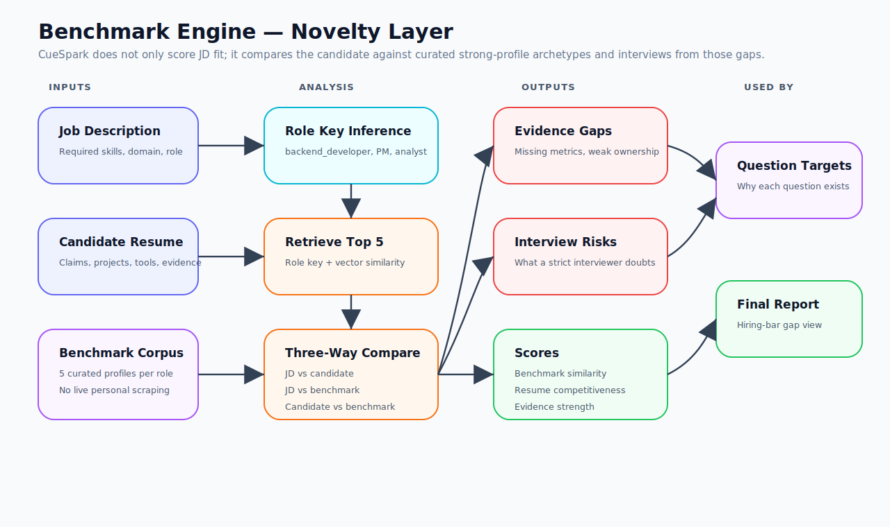
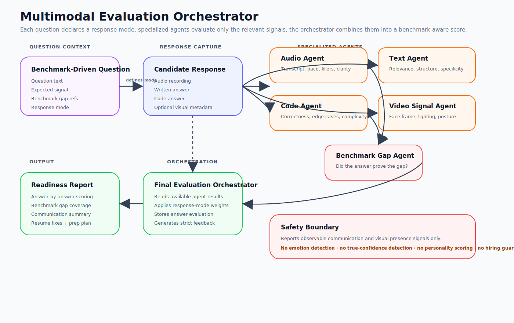

# CueSpark Interview Coach

**CueSpark Interview Coach** is a benchmark-driven, multimodal AI interview readiness platform.

CueSpark helps candidates prepare for a target role by comparing their resume against the job description and a curated role-specific benchmark corpus, generating strict benchmark-driven interview questions, capturing candidate responses across relevant modalities, and producing a readiness report based on evidence, communication, code/text quality, and benchmark-gap coverage.

> Practice against the hiring benchmark — not just against an AI chatbot.

---

## Product Thesis

Most interview preparation tools stop at question generation.

A candidate can paste a job description and resume into an AI model and get useful practice questions. But that still does not answer the deeper question:

```txt
How far am I from the actual hiring bar for this role?
```

CueSpark adds two product layers that generic mock-interview tools do not provide:

1. **Benchmark intelligence** — compare the candidate against curated strong-profile archetypes for the role.
2. **Multimodal evaluation** — evaluate how the candidate responds through audio, written text, code, and safe visual presence signals when relevant.

The product is built around this core loop:

```txt
JD + Resume + Benchmark Profiles
  → Benchmark Gaps
  → Gap-Driven Interview Questions
  → Multimodal Candidate Response
  → Specialized Evaluation Agents
  → Benchmark-Aware Readiness Report
```

---

## What CueSpark Does

CueSpark answers five practical questions for a candidate:

- What does this job actually require?
- What does my resume prove well?
- What do stronger candidates usually show that I do not?
- What will a strict interviewer likely challenge?
- How well did I answer, explain, write, code, and communicate against those gaps?

It identifies:

```txt
missing skills
weak evidence
missing metrics
weak ownership signals
shallow project depth
interview risk areas
communication gaps
written-answer gaps
code-quality gaps
benchmark-gap coverage
```

The output is not just a score. The output is a **preparation strategy**.

---

## Product Flow


The intended product journey:

1. Candidate enters a job description.
2. Candidate uploads or pastes a resume.
3. Optional interviewer context can be provided later as user-supplied text/PDF.
4. Backend parses, chunks, and embeds the JD and resume.
5. Backend generates JD-resume match analysis and role key.
6. Benchmark engine retrieves relevant curated role benchmark profiles.
7. Candidate is compared against the role benchmark corpus.
8. Benchmark dashboard shows similarity, evidence strength, gaps, and risk areas.
9. CueSpark generates benchmark-driven interview questions.
10. Each question declares its expected response mode: spoken, written, code, or mixed.
11. Candidate responds through the required modality.
12. Specialized agents evaluate the response.
13. Final orchestrator combines agent outputs into answer scores.
14. Readiness report summarizes benchmark gap coverage, answer quality, communication signals, code/text quality, resume fixes, and preparation plan.

---

## System Architecture


| Layer | Responsibility |
| --- | --- |
| Next.js frontend | Setup, benchmark dashboard, interview room, response capture, final report |
| FastAPI backend | Session APIs, upload APIs, benchmark APIs, question APIs, answer APIs, report APIs |
| Redis + RQ workers | Session preparation, TTS, transcription, modality-agent analysis, evaluation orchestration, reports |
| Postgres + pgvector | Sessions, documents, benchmark profiles, comparisons, answers, agent results, evaluations, reports, embeddings |
| MinIO | Resume uploads, generated interviewer audio, candidate answer audio, optional artifacts |
| OpenAI gateway | Embeddings, TTS, transcription, structured LLM analysis, text/code evaluation support |
| Benchmark engine | Role corpus retrieval, candidate-vs-benchmark comparison, gap analysis, question targets |
| Multimodal agents | Audio, text, code, video-signal, benchmark-gap, and final orchestration agents |

Architecture rules:

- Keep FastAPI routes thin.
- Put business logic in services.
- Put slow work in RQ tasks.
- Do not call OpenAI directly from frontend.
- Keep prompts centralized and versioned.
- Keep LLM outputs structured with Pydantic schemas.
- Store large binary artifacts in MinIO, not Postgres.

---

## Benchmark Engine



The benchmark engine is the product’s first differentiator.

Instead of generating generic questions, CueSpark compares:

```txt
Candidate Resume ↔ Job Description ↔ Curated Benchmark Profiles
```

It produces:

```txt
benchmark_similarity_score
resume_competitiveness_score
evidence_strength_score
missing_skills
weak_skills
missing_metrics
weak_ownership_signals
interview_risk_areas
recommended_resume_fixes
question_targets
```

These outputs feed:

- benchmark dashboard
- question generation
- benchmark-gap scoring
- final readiness report
- resume improvement suggestions

Benchmark profiles are curated/anonymized role archetypes. CueSpark should not default to scraping LinkedIn, Naukri, job boards, or personal resumes. If interviewer or public-profile context is used later, it should be user-provided by upload or paste.

Detailed design: [`docs/13-benchmark-engine-design.md`](docs/13-benchmark-engine-design.md)

---

## Multimodal Evaluation Orchestrator



The second product differentiator is multimodal evaluation.

Each question can define an expected response mode:

```txt
spoken_answer
written_answer
code_answer
mixed_answer
```

CueSpark then runs only the relevant evaluators.

### Audio Agent

Used for spoken and mixed answers.

Evaluates:

- transcript
- speaking pace
- filler words
- pause/hesitation markers
- clarity
- answer structure
- communication signal score

### Text Answer Agent

Used for written responses, pseudocode explanations, stakeholder communication tasks, case answers, and non-technical written questions.

Evaluates:

- relevance
- structure
- specificity
- evidence
- completeness
- clarity

### Code Evaluation Agent

Used for coding or technical implementation questions.

Evaluates:

- correctness
- edge cases
- complexity
- readability
- testability
- explanation quality

The first production version should use safe static analysis and optional sample test reasoning. Arbitrary code should not be executed on the main backend.

### Video Signal Agent MVP

Used only for safe observable signals.

Evaluates:

- face in frame
- lighting quality
- camera presence
- eye contact proxy
- posture stability
- distraction markers

CueSpark must not claim emotion detection, personality detection, truthfulness detection, or true confidence detection.

### Benchmark Gap Agent

Evaluates whether the answer actually addresses the benchmark gap that caused the question to be asked.

This remains the central scoring idea:

```txt
Did the candidate prove the gap CueSpark identified?
```

### Final Evaluation Orchestrator

Combines available agent outputs using dynamic scoring based on response mode.

Example spoken-answer scoring:

```txt
benchmark gap coverage: 30%
answer relevance: 20%
evidence/examples: 20%
communication clarity: 15%
role-specific depth: 10%
visual/audio professionalism: 5%
```

Detailed design: [`docs/16-multimodal-evaluation-orchestrator.md`](docs/16-multimodal-evaluation-orchestrator.md)

---

## Data and Storage Model


Core tables:

```txt
interview_sessions
documents
benchmark_profiles
benchmark_comparisons
interview_questions
candidate_answers
agent_results
answer_evaluations
interview_reports
embedding_chunks
jobs
```

Optional/future context table:

```txt
interviewer_contexts
```

Object storage paths:

```txt
resumes/original/{session_id}/{filename}
audio/questions/{question_id}.mp3
audio/answers/{answer_id}.webm
reports/{session_id}.json
```

Rules:

- Store structured data in Postgres.
- Store vectors in pgvector using `embedding_chunks`.
- Store modality-agent outputs in `agent_results`.
- Store final answer-level evaluation in `answer_evaluations`.
- Store final session report in `interview_reports`.
- Store binary files in MinIO.
- Store object keys in the database, not file bytes.
- Prefer storing video-signal summaries over full video files in the MVP.

---

## Interview Question Types

CueSpark supports mixed interview categories:

```txt
technical
project_experience
behavioral
hr
resume_gap
jd_skill_validation
benchmark_gap_validation
```

For non-software jobs, `technical` means role-specific competency, not programming.

Each generated question should include:

```txt
question_text
category
difficulty
expected_signal
source/provenance
why_this_was_asked
benchmark_gap_refs
response_mode
required_modalities
```

Example:

```json
{
  "category": "benchmark_gap_validation",
  "response_mode": "spoken_answer",
  "requires_audio": true,
  "requires_video": false,
  "requires_text": false,
  "requires_code": false,
  "benchmark_gap_refs": ["weak_project_ownership", "missing_metric"]
}
```

---

## Safety and Product Boundaries

CueSpark should use careful language.

Use:

```txt
benchmark profiles
curated top-candidate archetypes
role benchmark corpus
observable communication signals
visual presence signals
eye contact proxy
posture stability
speech pace
filler words
answer structure
readiness recommendation
interview risk areas
```

Avoid:

```txt
hired resumes
selected resumes
LinkedIn-selected profiles
true confidence detection
emotion detection
personality detection
truthfulness detection
selection guarantee
```

The product can say:

```txt
This answer shows weak evidence of ownership.
```

It should not say:

```txt
The candidate lacks confidence or has a poor personality.
```

---

## Tech Stack

| Area | Technology |
| --- | --- |
| Frontend | Next.js App Router, TypeScript, Tailwind |
| Backend API | FastAPI |
| Database | PostgreSQL |
| Vector Search | pgvector |
| Queue | Redis + RQ |
| Object Storage | MinIO |
| AI Provider | OpenAI through backend gateway, with mock mode for development |
| Interviewer Voice | OpenAI TTS |
| Transcription | OpenAI transcription / Whisper-compatible flow |
| Code Editor | Monaco editor later, after core answer flow is stable |
| Local Runtime | Docker Compose |

---

## Quick Start

```bash
cp .env.example .env
docker compose up --build
```

| Service | URL |
| --- | --- |
| Web | http://localhost:3000 |
| API | http://localhost:8000 |
| API Docs | http://localhost:8000/docs |
| MinIO Console | http://localhost:9001 |
| Postgres | localhost:5432 |
| Redis | localhost:6379 |

Default MinIO credentials:

```txt
minioadmin / minioadmin
```

---

## Required Environment Variables

The exact `.env.example` is the source of truth. Core variables:

```env
AI_PROVIDER=openai
AI_MOCK_MODE=true
OPENAI_API_KEY=
OPENAI_CHAT_MODEL=gpt-4o-mini
OPENAI_TTS_MODEL=gpt-4o-mini-tts
OPENAI_TTS_VOICE=marin
OPENAI_TRANSCRIBE_MODEL=gpt-4o-transcribe
OPENAI_EMBEDDING_MODEL=text-embedding-3-small

POSTGRES_USER=app
POSTGRES_PASSWORD=app
POSTGRES_DB=app
POSTGRES_HOST=postgres
POSTGRES_PORT=5432

REDIS_URL=redis://redis:6379/0

MINIO_ENDPOINT=minio:9000
MINIO_PUBLIC_ENDPOINT=http://localhost:9000
MINIO_BUCKET=uploads
MINIO_USE_SSL=false

NEXT_PUBLIC_API_URL=http://localhost:8000
```

Keep `AI_MOCK_MODE=true` during local development so features can be built without depending on paid AI calls.

---

## Backend Module Direction

Expected backend modules:

```txt
backend/app/api/
├── sessions.py
├── documents.py
├── benchmark.py
├── interview.py
├── audio.py
├── reports.py

backend/app/services/
├── openai_gateway.py
├── document_parser.py
├── chunking.py
├── embeddings.py
├── match_analyzer.py
├── benchmark_seed.py
├── benchmark_retrieval.py
├── benchmark_analyzer.py
├── question_generator.py
├── tts.py
├── transcription.py
├── audio_agent.py
├── text_answer_agent.py
├── code_evaluation_agent.py
├── video_signal_agent.py
├── benchmark_gap_agent.py
├── final_evaluation_orchestrator.py
├── report_generator.py
├── prompts.py
```

---

## Frontend Route Direction

Expected frontend routes:

```txt
/
  Landing / start page

/setup
  Job description and resume input

/session/[sessionId]/match
  JD-resume match and preparation status

/session/[sessionId]/benchmark
  Benchmark gap dashboard

/session/[sessionId]/interview
  Turn-based interview room with response-mode-aware capture

/session/[sessionId]/report
  Multimodal benchmark-aware readiness report
```

The benchmark dashboard and final report are the two most important product screens.

---

## Implementation Roadmap

The project has evolved beyond the hackathon demo. Continue implementation as a product in thin, verifiable layers.

### Completed / Existing Direction

```txt
Phase 0 — Foundation
Phase 1 — Session + Documents
Phase 2 — Embeddings + Match
Phase 2.5 — Benchmark Engine
Phase 3 — Interview Engine through on-demand TTS
```

### Next Product Phases

```txt
PHASE 4 — Multimodal Response Capture + Modality Agents
024 response modality model
025 multimodal answer upload
026 audio transcription + fluency agent
027 text answer agent
028 code evaluation agent
029 video signal agent MVP

PHASE 5 — Multimodal Evaluation + Report
030 agent result storage
031 benchmark gap coverage agent
032 final evaluation orchestrator
033 multimodal readiness report
```

Recommended execution order for a stable product:

```txt
1. response modality model
2. multimodal answer upload
3. audio transcription + fluency agent
4. agent result storage
5. benchmark gap coverage agent
6. final evaluation orchestrator
7. multimodal readiness report
8. text answer agent
9. code evaluation agent
10. video signal agent MVP
```

Why this order:

```txt
spoken answer → transcription → communication signals → benchmark gap coverage → final evaluation → report
```

This creates a usable product before adding advanced text/code/video modalities.

---

## Codex / Agent Development Rule

When using a coding agent, give it one task file at a time.

Recommended prompt pattern:

```txt
Read AGENTS.md, README.md, docs/00-project-overview.md, docs/01-architecture.md,
docs/13-benchmark-engine-design.md, docs/16-multimodal-evaluation-orchestrator.md,
and only the selected task file.

Implement only the selected task.
Do not add out-of-scope features.
Do not refactor unrelated files.
Report changed files and verification steps.
```

---

## Current Product Principle

CueSpark should not become a generic chatbot, a surveillance-style interview proctor, or a vague AI scoring tool.

The product principle is:

```txt
Every question should have a reason.
Every response should be evaluated against that reason.
Every report should tell the candidate what evidence is missing and how to improve.
```

The strongest product loop is:

```txt
Benchmark Gap Dashboard
  → Gap-Driven Interview
  → Multimodal Response Evaluation
  → Benchmark-Aware Readiness Report
```
