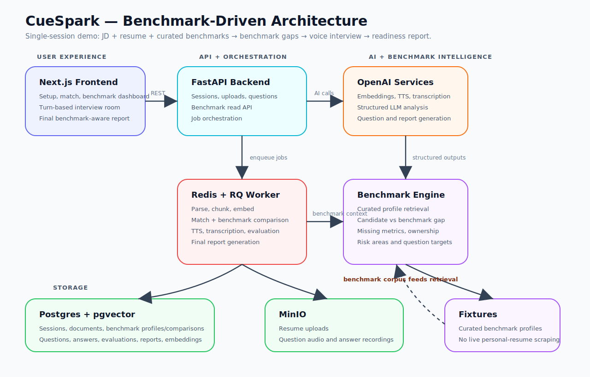
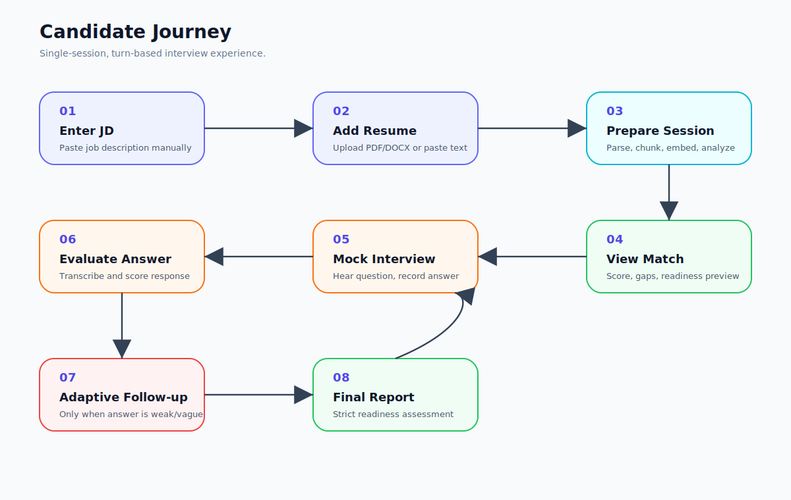
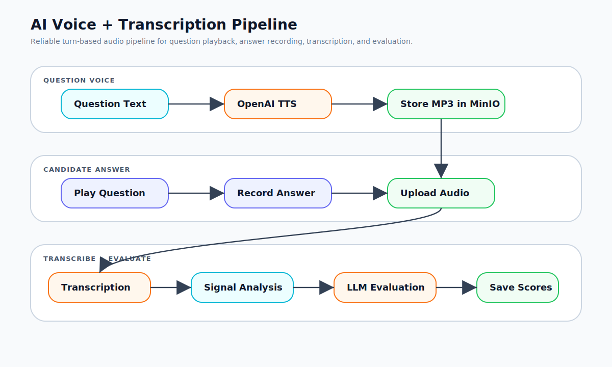
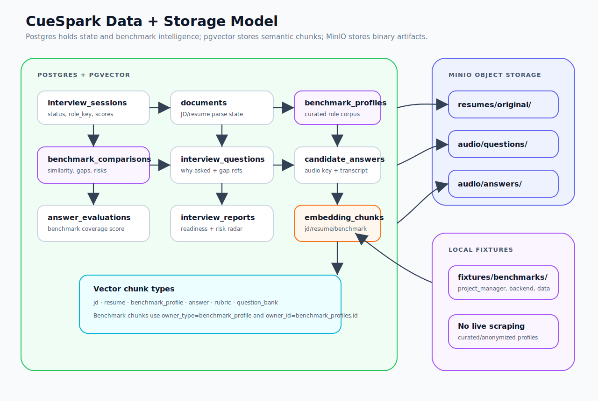
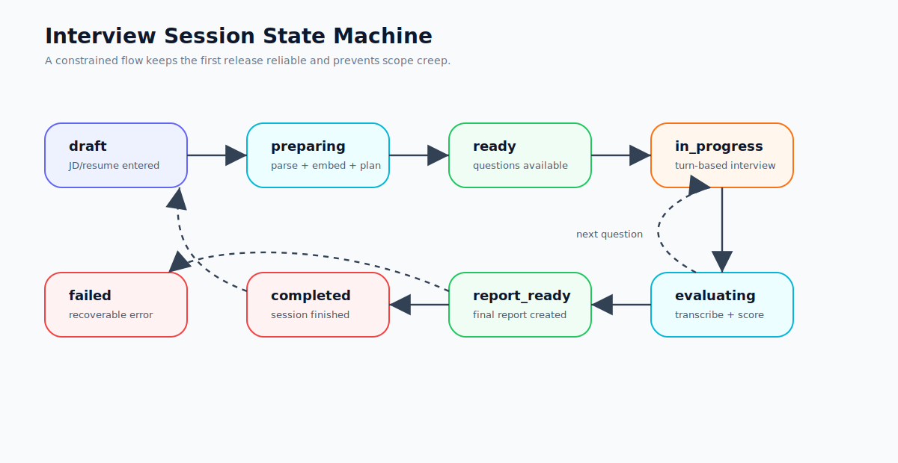

# CueSpark Interview Coach

**CueSpark Interview Coach** is a voice-based AI mock interview platform for job seekers and experienced professionals preparing for role transitions.

The application takes a job description and a candidate resume, creates a personalized interview plan, conducts a turn-based mock interview using AI-generated interviewer voice, transcribes candidate answers, evaluates performance, and produces a strict interviewer-style readiness report.

This project uses a production-friendly architecture based on **FastAPI**, **Next.js**, **Postgres + pgvector**, **Redis/RQ workers**, **MinIO**, and **OpenAI audio/LLM services**.

---

## Core Product Goal

CueSpark is designed for candidates who do not have access to an expert interviewer before applying for a role. Instead of generating generic questions, it uses the job description and resume to create a role-aware mock interview.

The first version is intentionally focused on a **single-session, turn-based interview flow**. It does not include accounts, payments, recruiter dashboards, video rooms, or realtime conversation.

---

## Architecture Overview



The architecture separates user-facing interactions, long-running AI work, structured data, file storage, and AI provider calls.

| Layer | Responsibility |
| --- | --- |
| Next.js frontend | Setup flow, interview UI, audio recording, report UI |
| FastAPI backend | Session APIs, upload APIs, job orchestration, AI service coordination |
| Redis + RQ worker | Long-running tasks such as parsing, embedding, transcription, evaluation, report generation |
| Postgres + pgvector | Structured data, interview state, embeddings, reports |
| MinIO | Resume files, generated interviewer audio, candidate answer recordings |
| OpenAI services | TTS, transcription, embeddings, question generation, answer evaluation |

---

## Candidate Flow



The first release should support this flow:

1. Candidate pastes a job description.
2. Candidate uploads or pastes a resume.
3. Backend creates an interview session.
4. Resume and JD are parsed, chunked, and embedded.
5. AI generates a JD-resume match score and interview plan.
6. Candidate starts a turn-based mock interview.
7. AI interviewer asks one question at a time using generated voice.
8. Candidate records an answer.
9. Backend transcribes and evaluates the answer.
10. The system optionally creates adaptive follow-ups.
11. Final strict interviewer-style report is generated.

---

## AI Voice and Transcription Pipeline



The first version uses a reliable turn-based audio pipeline:

```txt
Question text
  → OpenAI TTS
  → store interviewer audio in MinIO
  → frontend plays question audio
  → candidate records answer
  → upload answer audio
  → OpenAI transcription
  → communication signal analysis
  → LLM answer evaluation
  → save scores and feedback
```

This avoids the complexity of realtime WebRTC conversation while still giving a polished voice-interview experience.

---

## Data and Storage Model



Use Postgres for structured application data and MinIO for large binary artifacts.

### Core Tables

```txt
interview_sessions
documents
interview_questions
candidate_answers
answer_evaluations
interview_reports
embedding_chunks
```

### Object Storage Paths

```txt
resumes/original/{session_id}/{filename}
audio/questions/{question_id}.mp3
audio/answers/{answer_id}.webm
reports/{session_id}.json
```

The database should store object keys, not raw files.

---

## Session State Machine



The session lifecycle should remain constrained in the first version:

```txt
draft
  → preparing
  → ready
  → in_progress
  → evaluating
  → report_ready
  → completed
```

A `failed` state should be available for recoverable errors during parsing, AI calls, transcription, or report generation.

---

## Product Scope

### In Scope for Version 1

- Manual job description input
- Resume upload
- Resume paste fallback
- PDF/DOCX/text parsing
- OCR-ready parse status, but no OCR implementation yet
- JD and resume chunking
- Embedding storage using Postgres + pgvector
- JD-resume match scoring
- Mixed interview question generation
- Turn-based interview flow
- OpenAI-generated interviewer voice
- Candidate audio recording and upload
- Candidate audio transcription
- Answer-by-answer evaluation
- Communication signal scoring
- Final readiness report

### Interview Categories

The interview plan should generate questions across these categories:

```txt
technical
project_experience
behavioral
hr
resume_gap
jd_skill_validation
```

For non-software jobs, `technical` means role-specific competency, not programming.

---

## Out of Scope for Version 1

Do not implement these unless explicitly moved into scope:

- User login
- Multi-user accounts
- Payments or subscriptions
- Recruiter dashboard
- Admin dashboard
- Realtime AI conversation
- Google Meet-style video room
- Monaco editor
- Code compiler
- Full OCR pipeline
- Video-based confidence analysis
- Emotion detection
- Personality detection
- Custom voice cloning

The first version should focus on a strong interview engine, not platform expansion.

---

## Tech Stack

| Area | Technology |
| --- | --- |
| Frontend | Next.js App Router |
| Backend API | FastAPI |
| Database | PostgreSQL |
| Vector Search | pgvector |
| Queue | Redis + RQ |
| Object Storage | MinIO |
| AI Provider | OpenAI |
| Interviewer Voice | OpenAI TTS |
| Transcription | OpenAI transcription / Whisper-compatible flow |
| Local Runtime | Docker Compose |

---

## Recommended AI Services

| Capability | Recommended Direction |
| --- | --- |
| Interviewer voice | OpenAI TTS with professional interviewer instructions |
| Candidate transcription | OpenAI transcription model or Whisper-compatible flow |
| Embeddings | OpenAI text embeddings |
| Match analysis | LLM service module |
| Question generation | LLM service module with structured JSON output |
| Answer evaluation | LLM service module with rubric-based scoring |
| Final report | LLM service module with strict interviewer tone |

All AI calls should be isolated inside backend service modules. Do not call OpenAI directly from frontend pages or route handlers.

---

## Quick Start

```bash
cp .env.example .env
docker compose up --build
```

| Service | URL |
| --- | --- |
| Web | http://localhost:3000 |
| API | http://localhost:8000 |
| API Docs | http://localhost:8000/docs |
| MinIO Console | http://localhost:9001 |
| Postgres | localhost:5432 |
| Redis | localhost:6379 |

Default MinIO credentials:

```txt
minioadmin / minioadmin
```

Change these in `.env` for any non-local environment.

---

## Required Environment Variables

```env
OPENAI_API_KEY=

POSTGRES_USER=postgres
POSTGRES_PASSWORD=postgres
POSTGRES_DB=cuespark_interview
POSTGRES_HOST=postgres
POSTGRES_PORT=5432

REDIS_URL=redis://redis:6379/0

MINIO_ENDPOINT=minio:9000
MINIO_ACCESS_KEY=minioadmin
MINIO_SECRET_KEY=minioadmin
MINIO_BUCKET=cuespark
MINIO_SECURE=false

NEXT_PUBLIC_API_BASE_URL=http://localhost:8000
```

---

## Project Layout

```txt
.
├── backend/
│   ├── app/
│   │   ├── api/              # FastAPI routers
│   │   ├── core/             # config, logging, db, redis, storage clients
│   │   ├── models/           # SQLAlchemy models
│   │   ├── schemas/          # Pydantic request/response contracts
│   │   ├── services/         # business logic and AI services
│   │   ├── tasks/            # background jobs
│   │   └── workers/          # worker entrypoints
│   ├── tests/
│   ├── pyproject.toml
│   └── Dockerfile
│
├── frontend/
│   ├── src/
│   │   ├── app/              # Next.js App Router pages
│   │   ├── components/       # UI components
│   │   ├── hooks/            # frontend hooks
│   │   └── lib/              # API client and utilities
│   ├── package.json
│   └── Dockerfile
│
├── docs/
│   └── assets/               # SVG architecture and flow diagrams
├── tasks/                    # phase-based implementation tasks
├── infra/
│   └── minio-init.sh
├── docker-compose.yml
├── .env.example
├── AGENTS.md
└── README.md
```

---

## Backend Module Direction

Expected backend modules:

```txt
backend/app/api/
├── sessions.py
├── documents.py
├── interview.py
├── audio.py
├── reports.py

backend/app/services/
├── openai_client.py
├── document_parser.py
├── chunking.py
├── embeddings.py
├── match_analyzer.py
├── question_generator.py
├── tts.py
├── transcription.py
├── communication_analysis.py
├── answer_evaluator.py
├── report_generator.py

backend/app/tasks/
├── prepare_session.py
├── generate_question_audio.py
├── transcribe_answer.py
├── evaluate_answer.py
├── generate_report.py
```

Keep route handlers thin. Business logic should live in services. Slow operations should be run through workers.

---

## Frontend Route Direction

Expected frontend routes:

```txt
/
  Landing / start page

/setup
  Job description and resume input

/session/[sessionId]/match
  Match score and interview readiness preview

/session/[sessionId]/interview
  Turn-based mock interview

/session/[sessionId]/report
  Final strict interviewer report
```

Frontend API calls should be centralized inside `frontend/src/lib`.

---

## Scoring Rubric

Each answer should be evaluated using a strict interviewer rubric.

| Metric | Description |
| --- | --- |
| Relevance | Did the answer address the question directly? |
| Role-specific depth | Did the candidate demonstrate actual competency? |
| Evidence/examples | Did the candidate provide concrete proof, examples, metrics, or ownership? |
| Clarity and structure | Was the answer organized and easy to follow? |
| JD alignment | Did the answer connect to the job requirements? |
| Risk/gap handling | Did the candidate handle weak areas honestly and credibly? |
| Communication signal | Was the speech clear, concise, and low in avoidable hesitation? |

The final report should include:

```txt
1. Overall readiness score
2. JD-resume match analysis
3. Interview performance summary
4. Answer-by-answer feedback
5. Skill gaps
6. Resume improvement suggestions
7. Suggested preparation plan
8. Hiring-style recommendation
```

---

## Communication Signal Analysis

The first version may estimate communication quality using measurable signals:

- transcript length
- word count
- speaking speed
- filler words
- repetition
- answer structure
- clarity
- hesitation markers
- relevance to question

Use this language:

```txt
communication signal score
```

Avoid unsupported claims such as:

```txt
emotion detection
true confidence detection
personality detection
```

---

## Development Commands

```bash
make dev
```

Start the full local stack.

```bash
make logs
```

Tail service logs.

```bash
make shell-api
```

Open a shell inside the API container.

```bash
make worker-restart
```

Restart the worker after changing background tasks.

If Makefile commands are unavailable, use Docker Compose directly:

```bash
docker compose up --build
docker compose logs -f
docker compose restart worker
```

---

## Task-Based Development

Implementation tasks should live in the `tasks/` folder and be executed phase by phase.

Recommended order:

```txt
phase0-foundation
phase1-session-documents
phase2-interview-engine
phase3-answer-evaluation
phase4-report-frontend
phase5-future-scope
```

When using Codex or another coding agent, give it one task file at a time.

Recommended instruction:

```txt
Read AGENTS.md, the relevant docs, and only the selected task file.
Implement only the selected task.
Do not add out-of-scope features.
Report changed files and verification steps.
```

---

## Development Rules

- Keep the first version single-session.
- Do not add login until explicitly required.
- Do not add billing.
- Do not add recruiter dashboards.
- Do not build realtime video interview mode yet.
- Do not build OCR now; only keep parse status support for `ocr_required`.
- Do not hardcode OpenAI calls inside route handlers.
- Keep AI calls inside service modules.
- Use background workers for slow operations.
- Store large files in MinIO.
- Store structured data in Postgres.
- Store embeddings in pgvector.
- Keep frontend API calls inside `frontend/src/lib`.
- Prefer small, testable modules over large monolithic files.

---

# CueSpark Codex Guardrails Pack

## Contents

```txt
docs/
  08-implementation-sequence.md
  09-api-contracts-detailed.md
  10-data-model-contract.md
  11-prompt-registry.md
  12-codex-working-method.md

tasks/
  TASK_TEMPLATE.md

fixtures/
  sample_job_description.txt
  sample_resume.txt
  sample_transcript.txt
```

## Purpose

These files help Codex implement the project phase by phase without drifting into out-of-scope work.

Use one task file at a time and keep Codex focused on the current phase only.

## Current Milestone

The first stable milestone is:

```txt
A candidate can paste a JD, upload or paste a resume, generate a personalized interview, hear AI-spoken questions, record spoken answers, receive transcriptions, get strict answer feedback, and view a final readiness report.
```

That is the core product.
